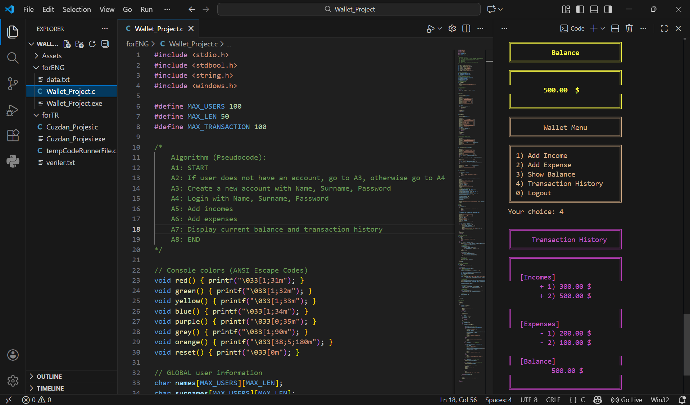

# Wallet_Project ||💰 
A simple wallet application

  

## 🚀 Features
- User registration and login system
- Income and expense tracking
- Automatic balance calculation
- Transaction history display
- Data persistence using text file
- Input validation and buffer cleaning
- Colored console output for better UX

## 🛠️ Concepts Used
- Arrays and multi-dimensional arrays
- Functions and modular programming
- File I/O (fopen, fprintf, fgets)
- String operations (strcmp, strncpy)
- Input validation and basic error handling

## 📂 Data Storage
User data is stored in a text file and automatically loaded when the program starts.

## 👩‍💻 Author
- fatmaSsm

